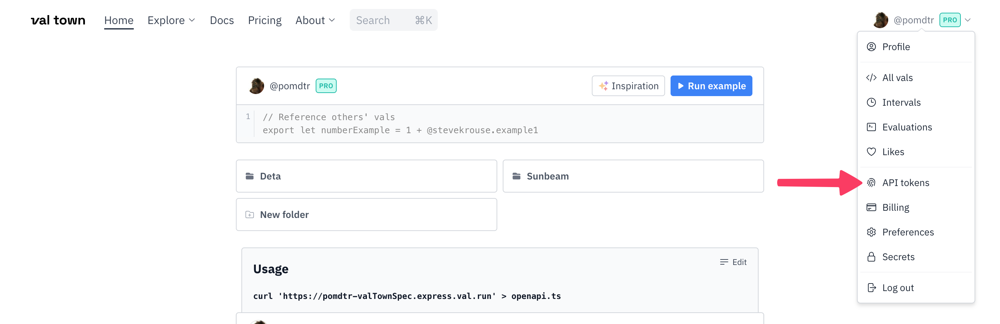

# vt - A companion cli for val.town

## Installation

You will need to install [deno](https://deno.land/) first.

```bash
deno install -Arf http://deno.land/x/vt_cli/vt.ts
```

## Authentication

Set the `VALTOWN_TOKEN` environment variable. You can generate a new one from [here](https://www.val.town/settings/api).



## Features

- Manage, Edit and Serve your vals locally
- List/Upload/Download/Delete Blobs
- Execute sqlite queries, import csv files

## Usage

Run `vt --help` to get a list of all available commands.
